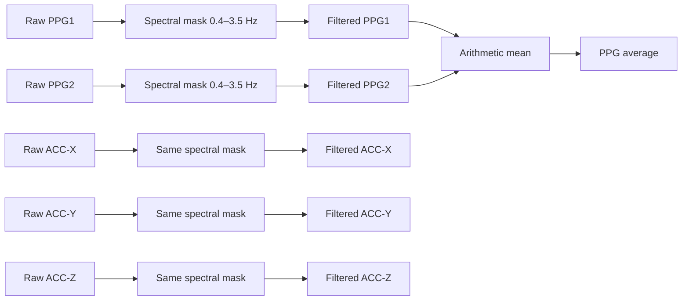

# Phase 2B — CPC Preprocessing Replication

## 1. Status

**PASS.** Phase 2B preprocessing baseline đã triển khai và kiểm chứng; Phase 2A vẫn PASS. Report lưu trực tiếp trong `reports/`, giữ chỉ mục `phase_2b_` ở đầu filename.

## 2. Scope

Implemented: spectral-domain coefficient masking riêng PPG1, PPG2, ACC-X/Y/Z; arithmetic mean của filtered PPGs; typed config/output; validation; synthetic/real-data tests; bốn diagnostic figures.

Không triển khai LMS, RLS, cascade, CPC convex combination, HR spectral estimation/peak tracking, smoothing, post-processing, lambda sweep hoặc AAE/Pearson/Bland–Altman evaluation. FFT power trong figures chỉ là chẩn đoán preprocessing, không là HR estimator.

## 3. Paper-specified preprocessing

Đã đọc lại [CPC paper local, §3.1 p.19](<../docs/Healthcare Tech Letters - 2018 - Islam - Cascade and parallel combination  CPC  of adaptive filters for estimating heart.pdf>). Paper quy định:

- Loại spectral coefficients ngoài desired frequency band **0.4–3.5 Hz**, được paper mô tả tương ứng khoảng 25–210 BPM.
- Lọc riêng hai PPG channels trong spectral domain.
- Cùng bandpass filtering áp dụng riêng trên cả ba accelerometer axes.
- Lấy trung bình hai PPG **đã lọc**, như mô tả Fig.1, nhằm giảm random noise và cải thiện biểu hiện cardiac spectral peak.

Các điểm này là **PAPER-SPECIFIED**. Không suy ra implementation FFT cụ thể hoặc mức cải thiện HR từ mô tả đó. Fs/channel mapping/alignment dùng nguyên API và protocol **DATASET-CONFIRMED** của Phase 2A. BPM0 chỉ được chuyển tiếp làm metadata; ECG không được lọc và không là CPC preprocessing input.

## 4. Reconstruction assumptions

Baseline **RECONSTRUCTION-ASSUMPTION**, không được paper chốt đầy đủ:

1. Mỗi cửa sổ Phase 2A 8 s được lọc độc lập; không global-record filtering và không carry state.
2. `NFFT=L=1000`, không zero-padding.
3. `numpy.fft.rfft(x, n=L)` và `rfftfreq(L, d=1/Fs)`.
4. Inclusive mask `(f >= 0.4) & (f <= 3.5)`; coefficients ngoài mask đặt bằng zero.
5. `irfft(X_masked, n=L)` trả đúng L samples và output số thực; Hermitian negative-frequency support được rFFT/irFFT biểu diễn ngầm.
6. Không detrend, spectral taper, normalization, standardization, resampling, overlap-add hoặc edge padding. DC bị loại do ngoài band; không trừ mean riêng.
7. Finite-window FFT có quy ước periodic/circular; không nối các windows trở lại một filtered recording.

Rationale: trực tiếp thực hiện loại spectral coefficients, giữ reconstruction real-valued và đúng analysis units Phase 2A, thêm ít processing nhất. Overlapping windows được xử lý riêng; không yêu cầu những samples chung giữa hai windows có filtered value giống nhau.

Các lựa chọn được chốt theo paper và baseline người dùng yêu cầu; không chọn/tune bằng BPM0, HR error hoặc AAE. Không khẳng định tác giả dùng rFFT, NFFT=1000 hay per-window filtering.

## 5. Discrete frequency interpretation

| Quantity | Baseline value | Classification |
| --- | --- | --- |
| Fs | 125 Hz | DATASET-CONFIRMED; PAPER-SPECIFIED |
| Window length | 1000 samples = 8 s | DERIVED từ Fs/window protocol |
| NFFT | 1000 | RECONSTRUCTION-ASSUMPTION |
| `df = Fs/NFFT` | 0.125 Hz | DERIVED |
| Requested paper band | 0.4–3.5 Hz | PAPER-SPECIFIED |
| First retained nonnegative frequency | 0.5 Hz | DERIVED từ frequency mask |
| Last retained nonnegative frequency | 3.5 Hz | DERIVED từ frequency mask |
| Retained rFFT bin count | 25 | Tính bằng mask trong validator, không hard-code |

Bins xuất hiện tại bội số của 0.125 Hz: 0.375 < 0.4 và 0.5 ≥ 0.4; 3.5 được biểu diễn chính xác. Retained bins là 0.500, 0.625, …, 3.500 Hz. **Effective discrete retained range 0.5–3.5 Hz không đổi intended paper passband 0.4–3.5 Hz.**

## 6. Implementation

Files inspected, với nội dung source/config/docs hoặc paper được đọc trong Phase 2B:

- `src/cpc_ppg/__init__.py`.
- `src/cpc_ppg/data/__init__.py`, `protocol.py`, `models.py`, `errors.py`, `discovery.py`, `loader.py`, `segmentation.py`, `validation.py`.
- `tests/data/conftest.py`, `test_discovery.py`, `test_loader.py`, `test_segmentation.py`, `test_phase2a_integration.py`.
- `scripts/validate_phase2a_loader.py`, `pyproject.toml`, `requirements.txt`.
- `data/metadata/dataset_schema.yaml`, `docs/assumptions/reconstruction_assumptions.md`.
- `reports/phase_2a_loader_alignment_report.md`, `reports/data/dataset_documentation_reconciliation.md`.
- `docs/Healthcare Tech Letters - 2018 - Islam - Cascade and parallel combination  CPC  of adaptive filters for estimating heart.pdf`, đặc biệt §3.1 p.19.
- Repository tree được kiểm tra để tìm preprocessing/plotting utilities; chưa có implementation preprocessing hoặc visualization để reuse. Đã kiểm tra instructions `AGENTS.md` trong project/ancestors; không tìm thấy.

Files created:

| File | Role |
| --- | --- |
| `src/cpc_ppg/preprocessing/config.py` | Frozen typed baseline config; band validation; reject unsupported FFT modes |
| `src/cpc_ppg/preprocessing/models.py` | Separate PreprocessedWindow, six float64 signals and alignment metadata |
| `src/cpc_ppg/preprocessing/spectral.py` | Vectorized rFFT mask / irFFT; finite real input/output checks |
| `src/cpc_ppg/preprocessing/pipeline.py` | Five individual filters, subsequent filtered PPG mean, Phase 2A record convenience API |
| `src/cpc_ppg/preprocessing/validation.py` | Metadata/shape/finite/mean checks and scale-aware spectral leakage metrics |
| `src/cpc_ppg/preprocessing/diagnostics.py` | Four standalone Agg/Matplotlib FFT-power figures |
| `src/cpc_ppg/preprocessing/__init__.py` | Public config/model/filter/window/record API |
| `scripts/validate_phase2b_preprocessing.py` | Full Training validation, counters, optional JSON/figures, PASS/FAIL exit |
| `tests/preprocessing/conftest.py` | Distinct synthetic channel fixtures |
| `tests/preprocessing/test_spectral.py` | Analytic bin frequencies, direct FFT references, invalid inputs |
| `tests/preprocessing/test_pipeline.py` | Config, channel identity, instrumented filter order, label independence, raw integrity |
| `tests/preprocessing/test_validation.py` | Spectral roundoff/scale and deliberate output corruption checks |
| `tests/preprocessing/test_diagnostics.py` | Figure axes, channel curves and power identity |
| `tests/preprocessing/test_phase2b_integration.py` | All 12 records/all windows, MAT hashes, CLI/figure checks |
| `reports/phase_2b_validation_summary.json` | Machine-readable real-data evidence and figure paths |
| `reports/figures/phase_2b/A_ppg1_raw_filtered_spectrum.png` | Figure A |
| `reports/figures/phase_2b/B_ppg2_raw_filtered_spectrum.png` | Figure B |
| `reports/figures/phase_2b/C_filtered_ppg_average_spectrum.png` | Figure C |
| `reports/figures/phase_2b/D_filtered_acc_spectra.png` | Figure D |
| `reports/phase_2b_preprocessing_report.md` | This report |

File modified: `docs/assumptions/reconstruction_assumptions.md`. A02 được chốt **BASELINE-RESOLVED; AUTHOR IMPLEMENTATION UNRESOLVED**; thêm bảng classification Phase 2B. A01 và A03–A11, gồm các assumptions LMS/RLS/state/HR/post-processing, giữ nguyên rows/status OPEN.

Không sửa Phase 2A code/tests/script, schema, requirements hoặc package configuration. Không thêm dependency. Core loader/preprocessing không dùng pandas hoặc plotting imports.

Public usage trong source environment đã cấu hình:

```python
from cpc_ppg.data import load_all_training_records
from cpc_ppg.preprocessing import PreprocessingConfig, preprocess_record

config = PreprocessingConfig()
record = load_all_training_records("data/Training_data")[0]
windows = preprocess_record(record, config)
# windows[0].ppg_avg: desired signal for a later adaptive filtering phase.
# windows[0].acc_x_filtered / acc_y_filtered / acc_z_filtered: later references.
```

`PreprocessedWindow` lưu record_id, index, start/end sample/time, BPM metadata; filtered PPG1/PPG2, their average, filtered ACC-X/Y/Z và Fs/band metadata. Không lưu raw-window copy hoặc ECG. Output buffers riêng, float64, chỉ đọc; đây là **ENGINEERING-DECISION**, không phải yêu cầu về dtype của paper.

## 7. Preprocessing data flow



Record API gọi `segment_training_record` Phase 2A trước, rồi preprocess từng window theo đúng order. Không average raw PPG trước lọc. Instrumented test kiểm tra đủ năm calls nhận chính raw arrays riêng lẻ; vì filter tuyến tính, chỉ kiểm tra output mean không đủ để chứng minh order.

## 8. Synthetic validation

| Input frequency/component | Expected behavior | Result |
| --- | --- | --- |
| DC; 0.25 Hz; 4.00 Hz | Loại coefficients ngoài requested band | PASS |
| 1.00 Hz; 2.50 Hz | Preserve exact-bin passband sinusoid trong numerical tolerance | PASS |
| 0.375 Hz | Reject | PASS |
| 0.500 Hz | Retain | PASS |
| 3.500 Hz | Retain inclusive upper boundary | PASS |
| 3.625 Hz | Reject | PASS |
| Zero input | Zero output, đúng length | PASS |

Direct rFFT-mask/irFFT reference test so khớp output chính xác; independent two-sided FFT mask theo absolute frequency cũng khớp, bao gồm conjugate negative frequencies. Tests odd/even length bảo vệ general primitive khỏi inverse FFT mất sample; production pipeline luôn yêu cầu L=1000.

Distinct frequencies/amplitudes trên năm kênh phát hiện channel swapping. Tests chứng minh mean của **filtered** PPGs, ECG không được đọc bởi window preprocessing, thay BPM metadata không đổi outputs, raw arrays/dtype/writeability flags không bị sửa. Sai shape, nonfinite, complex/nonnumeric, unsupported config, corrupted metadata/mean/spectral support đều bị phát hiện.

Validation numerical tolerance là **ENGINEERING-DECISION**:

```text
tau = 64 * eps_float64 * L = 1.4210854715202004e-11 for L=1000
max(|X_outside|) / max(|X|) <= tau
sum(|X_outside|²) / sum(|X|²) <= tau² = 2.0194839173657902e-22
```

Metrics được tính sau FFT lần hai của filtered output, với magnitudes chia theo max chỉ trong phép kiểm chứng để tránh overflow khi bình phương. Không normalize signal. Zero output có cả hai leakage metrics bằng 0. Tests xác nhận scale 0, 1e−100, 1 và 1e100 đều được xử lý; injection stopband detectable bị reject.

## 9. Real-data validation

Command, exit code **0**:

```bash
MPLCONFIGDIR=/tmp/cpc_phase2b_mplconfig .venv/bin/python \
  scripts/validate_phase2b_preprocessing.py \
  --summary-json reports/phase_2b_validation_summary.json \
  --figures-dir reports/figures/phase_2b
```

`MPLCONFIGDIR` chỉ đặt cache Matplotlib tại nơi có quyền ghi trong môi trường workspace; không ảnh hưởng processing. Script dùng Phase 2A API; không trực tiếp đọc biến MAT lại.

| Record ID | Input windows | Preprocessed windows | Status |
| --- | ---: | ---: | --- |
| DATA_01_TYPE01 | 148 | 148 | PASS |
| DATA_02_TYPE02 | 148 | 148 | PASS |
| DATA_03_TYPE02 | 140 | 140 | PASS |
| DATA_04_TYPE02 | 146 | 146 | PASS |
| DATA_05_TYPE02 | 146 | 146 | PASS |
| DATA_06_TYPE02 | 150 | 150 | PASS |
| DATA_07_TYPE02 | 143 | 143 | PASS |
| DATA_08_TYPE02 | 160 | 160 | PASS |
| DATA_09_TYPE02 | 149 | 149 | PASS |
| DATA_10_TYPE02 | 149 | 149 | PASS |
| DATA_11_TYPE02 | 143 | 143 | PASS |
| DATA_12_TYPE02 | 146 | 146 | PASS |
| **Total** | **1768** | **1768** | **PASS** |

```text
Training records: 12
Input windows: 1768
Preprocessed windows: 1768
Window-count mismatches: 0
Shape failures: 0
Finite-output failures: 0
PPG-average failures: 0
Out-of-band spectral failures: 0
Raw-integrity failures: 0
Alignment failures: 0
Other failures: 0
Overall status: PASS
```

Kiểm tra spectra của **tất cả 1768 windows × 5 filtered channels = 8840 spectra**, nhiều hơn minimum representative checks. Maximum out-of-band relative coefficient magnitude: **3.26018e−16**; maximum out-of-band energy fraction: **1.60773e−31**, đều dưới engineering tolerances. Cả sáu output arrays/window có shape (1000,), finite float64; mean đúng arithmetic mean. Record ID/index/bounds/times/BPM metadata giữ nguyên.

Evidence đầy đủ: [phase_2b_validation_summary.json](phase_2b_validation_summary.json).

## 10. Figures

Window được chọn xác định trước khi xem kết quả: **DATA_01_TYPE01, window 0, samples [0:1000]**. Không chọn window theo BPM hoặc HR error. Cả bốn PNG đã được mở kiểm tra: titles/legend/Hz axis rõ, requested-band shading đúng và stopband suppression hiển thị đến mức roundoff.

| Figure | File | Diagnostic purpose |
| --- | --- | --- |
| A | [PPG1 raw/filtered](figures/phase_2b/A_ppg1_raw_filtered_spectrum.png) | So coefficients raw với filtered PPG1, thấy giữ in-band và loại out-of-band |
| B | [PPG2 raw/filtered](figures/phase_2b/B_ppg2_raw_filtered_spectrum.png) | Kiểm chứng tương tự, riêng kênh PPG2 |
| C | [Filtered PPGs and average](figures/phase_2b/C_filtered_ppg_average_spectrum.png) | Phổ của PPG1 filtered, PPG2 filtered và time-domain arithmetic mean |
| D | [Filtered ACC axes](figures/phase_2b/D_filtered_acc_spectra.png) | Ba trục ACC dùng cùng requested band |

Plots dùng `abs(rFFT(x))²/L²`, log y-axis và Hz x-axis, không taper/padding/HR peak detection. Đây là diagnostic coefficient power, không chốt quy ước HR periodogram cho phase sau. Không có ground-truth marker hoặc claim cải thiện HR/AAE. Titles ghi “Replication diagnostic — representative dataset window”; không claim reproduction chính xác CPC Fig.1 hoặc cùng paper window.

## 11. Test results

Existing `.venv`: Python 3.12.10, pytest 9.1.1, pytest-cov 7.1.0; dùng NumPy/Matplotlib đã có, không cài dependency.

```bash
MPLCONFIGDIR=/tmp/cpc_phase2b_mplconfig .venv/bin/python -m pytest
MPLCONFIGDIR=/tmp/cpc_phase2b_mplconfig COVERAGE_FILE=/tmp/cpc_phase2b.coverage \
  .venv/bin/python -m pytest \
  --cov=cpc_ppg.preprocessing --cov=cpc_ppg.data --cov-report=term-missing \
  --cov-report=json:/tmp/cpc_phase2b_coverage.json \
  --junitxml=/tmp/cpc_phase2b_tests.xml
.venv/bin/python scripts/validate_phase2a_loader.py
```

- Full repository pytest: **153 passed in 5.94 s**, 0 failed, 0 skipped.
- Coverage run: **153 passed in 7.19 s**, 0 failed, 0 skipped.
- Phase 2A regression: **76 existing tests passed**, `cpc_ppg.data` coverage **229/229 = 100%**; Phase 2A validator exit 0, 12 records/1768 windows, zero failures.
- New preprocessing tests: **77 passed** — spectral 26, pipeline/config 29, validation 18, integration/CLI 3, diagnostics 1. Hai Phase 2B real-data integration tests đã chạy, không skip.
- `cpc_ppg.preprocessing` statement coverage: **203/207 = 98.07%**, bao gồm diagnostic module. Bốn statements chưa được exercise là numerical-overflow guards ở inverse FFT/mean/validation FFT magnitude, không là baseline processing paths. Đây không phải tuyên bố branch coverage hoặc script coverage.
- Lượt đầu một analytical channel test dùng absolute tolerance quá sát roundoff (sai khác khoảng 7e−14); đã sửa tolerance theo eps_float64 và amplitude, chạy lại toàn bộ thành công. Không đổi passband, FFT length, transforms hay output để làm test pass.

## 12. Integrity checks

- SHA-256 của **44/44 raw MAT files** toàn Training/Competition giữ nguyên trước và sau phase; không thêm/xóa/sửa MAT. Baseline/kết quả phiên làm việc: `/tmp/cpc_phase2b_raw_before.json`, `/tmp/cpc_phase2b_integrity.json`.
- Script và real integration tests kiểm tra riêng 24 Training MAT hashes trước/sau preprocessing. Hash chỉ đọc bytes; MAT extraction luôn qua Phase 2A API.
- Source/test/script SHA-256 của **14 Phase 2A files** giữ nguyên; schema/config/dependencies không thay đổi. Segmentation validator được chạy lại sau preprocessing.
- Raw channels, ECG, BPM arrays, dtype và writeability flags giữ nguyên; không ghi preprocessing state vào raw models. Output dataclass riêng, không chứa raw-window copies.
- Không normalization, detrending, resampling, extra taper, zero-padding, raw PPG averaging hoặc window loss. Đủ 1768 input/output windows và labels; first window vẫn index 0/start 0.
- A01 và A03–A11 rows của assumptions file được đối chiếu với git HEAD, giữ nguyên chính xác. Chỉ A02 được chốt baseline có chú thích author ambiguity.

## 13. Open issues

**Exact spectral filtering implementation của tác giả vẫn chưa được xác nhận.** Paper không quy định global-record hay per-window filtering, NFFT/padding, rFFT/two-sided choice, inclusive boundaries, taper/detrend, inverse/edge handling hoặc overlap reconstruction. Baseline hiện tại chỉ chốt một reconstruction tối giản, xác định và đã được kiểm chứng; không giải quyết bất định về phương pháp tác giả bằng assertion.

Không có lỗi triển khai/alignment chưa giải quyết trong baseline Phase 2B. Future LMS/RLS/state/periodogram/tracking/post-processing assumptions vẫn OPEN và chưa được dùng hay resolve ở đây.

## 14. Phase conclusion

**PASS.** Spectral coefficient masking đúng requested band; đủ năm kênh lọc riêng; PPG mean sau filtering; FFT reconstruction và bin-resolution consequences được phân loại rõ; outputs đúng 1000 samples; 12 records/1768 windows không mất alignment; raw hashes/arrays giữ nguyên; synthetic/real tests, spectral validation và Phase 2A regression pass; diagnostic figures, assumptions update và report hoàn tất.

**Phase 3 LMS/RLS implementation was NOT started.**
